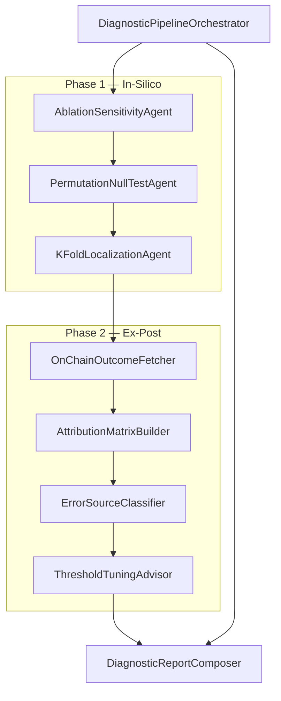

# Bridge / Filter-Diagnose — 9-Agenten-Spezifikation (Wave 38)

**Status:** Entwurf — implementierungsbereit  
**Pre-Registration:** `docs/BRIDGE_DIAGNOSTIC_PREREG.md` (**bindend**, 2026-08-22)  
**Charakter:** Querliegende Diagnose-Welle (analog Wave 21 Skynet: kontinuierliches Monitoring)  
**Modul:** `agents_b2g/diagnostic/`  
**Erstes Anwendungsfenster:** Bridge-CTE-Filter (`Z_alt`, `Z_neu`) — erweiterbar auf Trading/Defense-Filter

---

## 1. Fragestellung

Nach `V3_PERSISTENZ` bleibt offen, ob die Persistenz ein **echtes Signal** oder ein **Artefakt der Filter-Logik** ist (No-op-Konditionierer, Collider-Effekte, Sättigung). Die Diagnose-Suite trennt:

| Phase | Prüft | Fehlerklasse |
|---|---|---|
| **In-Silico** | Modell gegen sich selbst | Filter-Logik, Kodierung, Null-Struktur |
| **Ex-Post** | Modell gegen On-Chain-Realität | Ausführung, RPC, Priority-Fee |

**Phase-1-Fehler** → Modell-Fehler (Schwellen, Aggressivität, Kodierung).  
**Nur-Phase-2-Fehler** → Infrastruktur-Fehler (Bot, RPC) — Modell kann valide sein.

---

## 2. Architektur (9 Agenten)

| # | Agent | Phase | Verantwortung |
|---|---|---|---|
| 1 | `DiagnosticPipelineOrchestrator` | Root | Sequenz In-Silico → Ex-Post, Aggregation, finales Verdict |
| 2 | `AblationSensitivityAgent` | In-Silico | Entfernt je eine `Z_neu`-Komponente, misst ΔCTE, markiert „Bereinigungsarbeiter" |
| 3 | `PermutationNullTestAgent` | In-Silico | Timestamp-Permutation je Datenstrom; Filter auf Null-Daten muss neutral sein |
| 4 | `KFoldLocalizationAgent` | In-Silico | 9-Fold Resampling, Vorzeichen-Invarianz (P_sign ≥ 0,95), Event-Lokalisierung |
| 5 | `OnChainOutcomeFetcher` | Ex-Post | On-Chain-Ausführungsergebnisse, Match RELEASED/BLOCKED ↔ Erfolg/Revert |
| 6 | `AttributionMatrixBuilder` | Ex-Post | 2×2-Matrix TP / FP-infra / FN-model / TN |
| 7 | `ErrorSourceClassifier` | Ex-Post | Modell vs. Infrastruktur anhand der Matrix |
| 8 | `ThresholdTuningAdvisor` | Ex-Post | FN-model → Schwellen-Empfehlung für S(τ) und Filter-Aggressivität |
| 9 | `DiagnosticReportComposer` | Output | GoBD-Report PDF/A-3, WORM-Hash-Kette |



---

## 3. Modul-Layout & Konventionen

```
agents_b2g/diagnostic/
├── __init__.py                         # exports DiagnosticOrchestrator, DiagnosticSupervisor
├── diagnostic_orchestrator.py          # Agent 1
├── agents.py                           # Agents 2–8 + DiagnosticSupervisor
├── config.py                           # DiagnosticConfig, env, frozen constants
├── types.py                            # TypedDict / dataclasses für Artefakte
└── subagents/
    └── diagnostic_report_composer.py   # Agent 9 (PDF/A + WORM)

scripts/
├── bridge_diagnostic_pipeline.py       # CLI-Runner (Bridge-V3-first)
└── test_bridge_diagnostic.py           # Unit + Smoke

docs/
├── BRIDGE_DIAGNOSTIC_SPEC.md           # dieses Dokument
└── BRIDGE_DIAGNOSTIC_PREREG.md         # bindend (2026-08-22)
```

**Response-Envelope** (identisch zu Wave 17/20):

```json
{
  "status": "started|completed|failed",
  "job_id": "uuid",
  "artifacts": [{"type": "...", "format": "json|pdf", "path": "...", "metadata": {}}],
  "error": null,
  "logs": []
}
```

**Multi-Tenancy:** `{data_root}/{user_id}/diagnostic/{job_id}/`

**Reuse aus Bridge V3** (keine Duplikation):

| Modul | Funktionen |
|---|---|
| `scripts/bridge_stufe_a_v3_config.py` | `CANDIDATE_IDS`, `K_FOLDS`, `fold_minute_ranges()`, Seed |
| `scripts/bridge_stufe_a_v3_load.py` | `load_all_candidates()`, Occupancy-Loader |
| `scripts/bridge_stufe_a_v3_pipeline.py` | `encode_z_neu_tertile`, `cte_direction_slice`, `run_pipeline` (Teilpfade) |
| `scripts/bridge_stufe_a_stats.py` | `transfer_entropy_binary`, `benjamini_hochberg` |

---

## 4. Shared Input-Contract (`DiagnosticRunInput`)

```json
{
  "run_id": "uuid",
  "user_id": "kaemmerer_mueller",
  "domain": "bridge_cte",
  "pre_reg": "docs/BRIDGE_DIAGNOSTIC_PREREG.md",
  "v3_refs": {
    "integrity_gate": "bridge_stufe_a_v3_integrity_gate.json",
    "coverage_gate": "bridge_stufe_a_v3_coverage_gate.json",
    "ergebnis": "bridge_stufe_a_v3_ergebnis.json"
  },
  "inputs": {
    "bridge_eth": "bridge_eth.jsonl",
    "bridge_gnosis": "bridge_gnosis.jsonl",
    "drivers": "drivers_90d.jsonl",
    "candidates": {
      "chainlink": "bridge_stufe_a_v3_chainlink.jsonl",
      "intent_relayers": "bridge_stufe_a_v3_intent_relayers.jsonl",
      "liquidations": "bridge_stufe_a_v3_liquidations.jsonl",
      "stablecoin_mint_burn": "bridge_stufe_a_v3_stablecoin_mint_burn.jsonl",
      "mev_cluster": "bridge_stufe_a_v3_mev_cluster.jsonl"
    }
  },
  "options": {
    "seed": 20260819,
    "n_surrogates": 1000,
    "fdr_q": 0.05,
    "p_sign_threshold": 0.95,
    "permutation_n_shuffles": 100,
    "skip_ex_post": false,
    "allow_smoke": false
  }
}
```

**Gate vor Start (Orchestrator):**

1. `integrity_gate.status == "PASS"`
2. `v3_refs.ergebnis.verdict == "V3_PERSISTENZ"` (Diagnose setzt auf abgeschlossene V3-Serie auf)
3. Alle Input-Pfade existieren; Smoke-Manifeste verweigert unless `allow_smoke`

---

## 5. Agent-Schnittstellen

### 5.1 Agent 1 — `DiagnosticPipelineOrchestrator`

**Klasse:** `DiagnosticPipelineOrchestrator(user_id, data_root="archive_b2g/diagnostic")`

| Methode | Input | Output |
|---|---|---|
| `run_full_diagnosis(run_input: dict)` | `DiagnosticRunInput` | `DiagnosticRunOutput` (s. §6) |
| `run_in_silico_only(run_input)` | wie oben | Phase-1-Artefakte + Zwischen-Verdict |
| `get_status(job_id)` | UUID | Envelope mit Step-Fortschritt |

**Pipeline-Schritte (fest, sequentiell):**

```
GATE → ABLATION → PERMUTATION → KFOLD → [EXPOST_FETCH → MATRIX → CLASSIFY → TUNING] → REPORT → VERDICT
```

**Zwischen-Verdict (Phase 1 only):** `DIAG_IN_SILICO_PASS | DIAG_FILTER_ARTIFACT | DIAG_INCONCLUSIVE`

**Finales Verdict (§7):** nach Report-Composition.

---

### 5.2 Agent 2 — `AblationSensitivityAgent`

**Zweck:** Leave-one-out über `Z_neu`-Komponenten. Identifiziert, welche Entfernung CTE senkt (Bereinigungsarbeiter) vs. welche No-ops sind (ΔCTE = 0).

**API:**

```python
def run(
    self,
    *,
    eth_occ: Sequence[int],
    gno_occ: Sequence[int],
    z_alt: list[list[int]],
    z_neu_ter: dict[str, list[int]],  # candidate_id → tertile bins
    z_neu_occ: dict[str, list[int]],   # raw occupancy (Informativitäts-Check)
    baseline_cte: dict[str, list[float]],  # aus v3 sensitivity_all_z_neu oder frisch berechnet
    rng: random.Random,
    n_surrogates: int,
) -> dict:
    ...
```

**Output-Artefakt:** `ablation_sensitivity.json`

```json
{
  "reference": "full_z_alt_union_all_z_neu",
  "reference_sum_cte": {"ab": 0.047058, "ba": 0.063024},
  "ablations": [
    {
      "removed_candidate": "chainlink",
      "drivers_remaining": ["z_alt", "intent_relayers", "liquidations", "stablecoin_mint_burn", "mev_cluster"],
      "sum_cte": {"ab": 0.038, "ba": 0.051},
      "delta_sum_cte": {"ab": -0.009, "ba": -0.012},
      "delta_pct": {"ab": -19.2, "ba": -19.0},
      "n_bh_significant": 58,
      "role": "cleansing_worker|neutral|inert",
      "inert_reason": null
    },
    {
      "removed_candidate": "intent_relayers",
      "delta_pct": {"ab": 0.0, "ba": 0.0},
      "role": "inert",
      "inert_reason": "occupancy_saturated_tertile_collapsed"
    }
  ],
  "cleansing_workers": ["chainlink", "mev_cluster"],
  "inert_components": ["intent_relayers", "stablecoin_mint_burn"]
}
```

**Rollen-Regeln (präregistrierbar):**

| `role` | Bedingung |
|---|---|
| `inert` | \|ΔCTE\| < ε (z. B. 0,1 %) **oder** byte-identisch zur Referenz |
| `cleansing_worker` | ΔCTE < −5 % (Senkung bei Entfernung → Komponente trug „Bereinigung") |
| `neutral` | sonst |

**Bridge-V3-Verdrahtung:** `z_neu_ter` / `z_neu_occ` via `bridge_stufe_a_v3_load`; Referenz-Summen-CTE aus `ergebnis.sensitivity_all_z_neu.observed_sums` (ab/ba).

---

### 5.3 Agent 3 — `PermutationNullTestAgent`

**Zweck:** Härtetest gegen No-ops und Phantom-Bereinigung. Permutiert Timestamps **eines** Streams; rekodiert Occupancy/Tertile; misst ob CTE/Signifikanz systematisch driftet.

**API:**

```python
def run(
    self,
    *,
    eth_occ, gno_occ, z_alt, z_neu_occ: dict[str, list[int]],
    permute_targets: list[str],  # default: CANDIDATE_IDS + optional "bridge_eth", "bridge_gnosis"
    n_shuffles: int,
    seed: int,
    n_surrogates: int,
) -> dict:
    ...
```

**Pro Target:** circular shift oder block-shuffle innerhalb 90-Tage-Fenster (Prä-Reg festlegen).

**Output:** `permutation_null.json`

```json
{
  "n_shuffles": 100,
  "targets": {
    "chainlink": {
      "observed_sum_cte_ab": 0.012,
      "null_mean_ab": 0.011,
      "null_std_ab": 0.0008,
      "p_perm": 0.42,
      "filter_neutral": true
    },
    "intent_relayers": {
      "observed_sum_cte_ab": 0.024,
      "null_mean_ab": 0.024,
      "p_perm": 1.0,
      "filter_neutral": true,
      "note": "expected inert — permutation cannot fix saturation"
    }
  },
  "failures": [],
  "verdict_fragment": "PERM_PASS|PERM_FAIL"
}
```

**Fail-Kriterium:** `filter_neutral == false` → Filter reagiert auf Struktur, die nach Permutation nicht existieren sollte → **`PERM_FAIL`** (Logikfehler).

**V3-Bezug:** Adressiert direkt die in §5.3 des V3-Dossiers dokumentierte No-op-Problematik; gesättigte Kandidaten erwarten `filter_neutral: true` bei Δ=0 (kein Fail, aber `inert` flag).

---

### 5.4 Agent 4 — `KFoldLocalizationAgent`

**Zweck:** Zeitliche Stabilität der Persistenz; bricht Vorzeichen-Invarianz lokal?

**API:**

```python
def run(
    self,
    *,
    eth_occ, gno_occ, z_alt, z_neu_ter: dict,
    fold_ranges: list[tuple[int, int]],  # bridge_stufe_a_v3_config.fold_minute_ranges()
    p_sign_threshold: float = 0.95,
    rng, n_surrogates,
) -> dict:
    ...
```

**Metrik pro Fold k:** Für jeden Lag τ und Richtung d: `sign(CTE_fold) == sign(CTE_full)` → Anteil `P_sign`.

**Output:** `kfold_localization.json`

```json
{
  "k_folds": 9,
  "fold_days": 10,
  "global_persistency": true,
  "folds": [
    {
      "fold_index": 0,
      "minute_range": [0, 14400],
      "p_sign_ab": 0.97,
      "p_sign_ba": 0.96,
      "n_bh_significant": 54,
      "localized_break": false,
      "candidate_events_in_fold": {"mev_cluster": 8123}
    }
  ],
  "break_folds": [],
  "verdict_fragment": "KFOLD_STABLE|KFOLD_LOCALIZED_BREAK"
}
```

**`KFOLD_LOCALIZED_BREAK`:** ∃ fold mit `p_sign < 0.95` **und** signifikanter Event-Dichte in einem Kandidaten → Persistenz event-gebunden, nicht global.

**Reuse:** Identische Fold-Geometrie wie V3 (`K_FOLDS=9`, `FOLD_DAYS=10`).

---

### 5.5 Agent 5 — `OnChainOutcomeFetcher`

**Zweck:** Ex-Post-Daten: Agent-X-Entscheidungen vs. Chain-Outcome.

**Bridge-V1-Scope:** Optional / Phase-2 — erfordert Execution-Log, der RELEASED/BLOCKED pro Minute/Tx dokumentiert. Für reine CTE-Diagnose: **`skip_ex_post: true`**.

**API:**

```python
def run(
    self,
    *,
    decision_log_path: Path | None,  # JSONL: {ts, decision, tx_hash, chain, ...}
    rpc_endpoints: dict[str, str],
    window_start, window_end,
) -> dict:
    ...
```

**Input JSONL-Zeile (`decision_log`):**

```json
{
  "timestamp": 1716163200.0,
  "decision": "RELEASED|BLOCKED",
  "tx_hash": "0x…",
  "chain": "ethereum|gnosis",
  "signal_lag_min": 6,
  "filter_snapshot": {"z_alt_bins": [1,0,2], "z_neu": "mev_cluster"}
}
```

**Output:** `onchain_outcomes.json`

```json
{
  "n_decisions": 1204,
  "n_matched": 1189,
  "n_rpc_gaps": 15,
  "outcomes": [
    {
      "tx_hash": "0x…",
      "decision": "RELEASED",
      "receipt_status": 1,
      "profit_wei": "…",
      "gas_used": 21000,
      "outcome_class": "success|revert|timeout|unknown"
    }
  ]
}
```

---

### 5.6 Agent 6 — `AttributionMatrixBuilder`

**Input:** `onchain_outcomes.json` + `decision_log`

**Output:** `attribution_matrix.json`

```json
{
  "cells": {
    "TP": {"count": 412, "rate": 0.34, "description": "RELEASED + Erfolg"},
    "FP_infra": {"count": 89, "rate": 0.07, "description": "RELEASED + Revert/Gas"},
    "FN_model": {"count": 156, "rate": 0.13, "description": "BLOCKED + entgangener Gewinn"},
    "TN": {"count": 532, "rate": 0.44, "description": "BLOCKED + Revert vermieden"}
  },
  "n_total": 1189
}
```

| Agent-X | On-Chain | Zelle |
|---|---|---|
| RELEASED | Erfolg | **TP** |
| RELEASED | Revert/Gas | **FP-infra** |
| BLOCKED | Gewinn entgangen | **FN-model** |
| BLOCKED | Revert vermieden | **TN** |

---

### 5.7 Agent 7 — `ErrorSourceClassifier`

**Input:** Phase-1-Fragmente + `attribution_matrix.json`

**Output:** `error_classification.json`

```json
{
  "primary_error_source": "none|model|infrastructure|mixed",
  "evidence": {
    "in_silico": {
      "permutation": "PERM_PASS",
      "ablation_inert_count": 2,
      "kfold": "KFOLD_STABLE"
    },
    "ex_post": {
      "fp_infra_rate": 0.07,
      "fn_model_rate": 0.13
    }
  },
  "rationale": "Permutation PASS + 2 inert Z_neu → kein Filter-Logikfehler; FN-model 13% → Schwellen prüfen (Agent 8)."
}
```

**Entscheidungsregel:**

| Bedingung | `primary_error_source` |
|---|---|
| `PERM_FAIL` oder Ablation zeigt Phantom-Cleansing auf permutierten Daten | `model` |
| Phase 1 PASS, aber `FP_infra_rate > FN_model_rate` | `infrastructure` |
| `FN_model_rate` hoch, Phase 1 PASS | `mixed` (Modell überkonservativ, nicht falsch) |
| Phase 1 PASS, Ex-Post skipped | `none` (nur In-Silico abgeschlossen) |

---

### 5.8 Agent 8 — `ThresholdTuningAdvisor`

**Input:** `error_classification.json`, `attribution_matrix.json`, V3-Lag-Peaks (τ=6 ab, τ=15/16 ba)

**Output:** `threshold_recommendations.json`

```json
{
  "recommendations": [
    {
      "parameter": "S_tau_ab_release",
      "current": 0.05,
      "suggested": 0.042,
      "direction": "lower",
      "rationale": "FN-model 13% — BLOCKED trotz profitablem Outcome",
      "evidence_cell": "FN_model",
      "confidence": "medium"
    }
  ],
  "non_actionable": [
    "FP_infra elevated — tune execution bot priority fee, not CTE filter"
  ]
}
```

**Regel:** Nur **`FN-model`**-Zellen indizieren Modell-Nachjustierung. **`FP-infra`** → Ausführungs-Bot, nicht Filter.

---

### 5.9 Agent 9 — `DiagnosticReportComposer`

**Input:** Gesamtes `{job_id}/` Artefakt-Verzeichnis

**Output:**

| Datei | Format |
|---|---|
| `diagnostic_report.pdf` | PDF/A-3 |
| `diagnostic_report_manifest.json` | Hash-Kette, GoBD-Metadaten |
| `diagnostic_audit.jsonl` | WORM append-only |

**Report-Sektionen:**

1. Executive Summary + finales Verdict  
2. V3-Kontext (`V3_PERSISTENZ`, 3/5 wirksam getestet)  
3. Ablation-Tabelle (cleansing_worker vs. inert)  
4. Permutation-Ergebnisse  
5. K-Fold-Stabilität  
6. Attributions-Matrix (falls Ex-Post)  
7. Empfehlungen (Agent 8)  
8. Protokoll-Satz Coverage-Gate (aus V3-Dossier §8)

**Reuse:** Pattern von `agents_b2g/compliance/subagents/pdf_audit_composer.py` + `finale/subagents/audit_trail.py`.

---

## 6. Aggregiertes Output (`DiagnosticRunOutput`)

```json
{
  "run_id": "uuid",
  "generated_at": "ISO-8601",
  "domain": "bridge_cte",
  "v3_verdict_ref": "V3_PERSISTENZ",
  "phase1": {
    "ablation": "ablation_sensitivity.json",
    "permutation": "permutation_null.json",
    "kfold": "kfold_localization.json",
    "fragment_verdict": "DIAG_IN_SILICO_PASS"
  },
  "phase2": {
    "skipped": false,
    "onchain": "onchain_outcomes.json",
    "matrix": "attribution_matrix.json",
    "classification": "error_classification.json",
    "tuning": "threshold_recommendations.json"
  },
  "final_verdict": "DIAG_SIGNAL_VALID|DIAG_FILTER_ARTIFACT|DIAG_OVERCONSERVATIVE|DIAG_INFRA_DOMINATED|DIAG_INCONCLUSIVE",
  "report_pdf": "diagnostic_report.pdf",
  "worm_hash": "sha256:…"
}
```

---

## 7. Verdict-Taxonomie

**Bindend:** `docs/BRIDGE_DIAGNOSTIC_PREREG.md` §6 (Schwellen §3).  
**Reichweite vor Ergebnis-Lektüre:** `docs/BRIDGE_DIAGNOSTIC_LESERHINWEISE.md` (interpretativ).

| Verdict | Bedingung (Kurzform — Details in Pre-Reg) |
|---|---|
| **`DIAG_SIGNAL_VALID`** | Phase 1 PASS + (Ex-Post skipped oder FN/FP unter τ) |
| **`DIAG_FILTER_ARTIFACT`** | `PERM_FAIL` oder Phantom-`cleansing_worker` |
| **`DIAG_OVERCONSERVATIVE`** | Phase 1 PASS + `FN_model_rate > 0,10` |
| **`DIAG_INFRA_DOMINATED`** | Phase 1 PASS + `FP_infra_rate > 0,15` dominant |
| **`DIAG_INCONCLUSIVE`** | Blocker, RPC-Lücken >20 %, `unclassified` >0 |

Registrierte Vorhersage (§1.2 Pre-Reg): `DIAG_SIGNAL_VALID` mit ≥2 `inert`
(theoretisch Intent + Stablecoin) — **falsifizierbar**, nicht aus Spec abgeleitet.

---

## 8. Attributions-Matrix (Referenz)

```
                    On-Chain
                 Erfolg    Revert/Gas
Agent-X  RELEASED   TP      FP-infra
         BLOCKED    FN-model   TN
```

- **TP:** System korrekt — kausales Signal isoliert  
- **FP-infra:** Signal valide, Ausführung fehlerhaft  
- **FN-model:** Filter überkonservativ → Agent 8  
- **TN:** Guard korrekt

---

## 9. CLI-Runner

```bash
# Phase 1 only (Bridge V3 Datenbasis, kein Decision-Log nötig)
python3 scripts/bridge_diagnostic_pipeline.py \
  --v3-ergebnis bridge_stufe_a_v3_ergebnis.json \
  --integrity-gate bridge_stufe_a_v3_integrity_gate.json \
  --input-dir . \
  --output bridge_diagnostic_ergebnis.json \
  --skip-ex-post

# Vollständig (mit Execution-Log)
python3 scripts/bridge_diagnostic_pipeline.py \
  --decision-log archive_b2g/diagnostic/decisions.jsonl \
  --gnosis-rpc "$GNOSIS_RPC" \
  --eth-rpc "$ETH_RPC"
```

**Laufzeit-Schätzung Phase 1:** ~4–6 h bei `n_surrogates=1000` (Ablation 5× + Permutation 100×5 Targets reduziert via Prä-Reg); Smoke-Modus: `n_surrogates=50`, `n_shuffles=10`.

---

## 10. Pre-Registration

**Erledigt:** `docs/BRIDGE_DIAGNOSTIC_PREREG.md` (bindend, 2026-08-22).

Konfirmatorischer Lauf erst nach expliziter Freigabe. Skeleton/Unit-Tests ohne
V3-CTE-Ausgabe dürfen parallel laufen (Pre-Reg §0.1).

---

## 11. Implementierungs-Reihenfolge

| Schritt | Deliverable | Abhängigkeit |
|---|---|---|
| 1 | `config.py`, `types.py`, Orchestrator-Skeleton | — |
| 2 | Agent 2 Ablation + Smoke-Test gegen V3-Daten | `v3_load`, `v3_pipeline` |
| 3 | Agent 3 Permutation | Ablation |
| 4 | Agent 4 K-Fold | `fold_minute_ranges` |
| 5 | CLI `--skip-ex-post` + JSON-Output | Agents 2–4 |
| 6 | Agents 5–8 (Ex-Post, stub-fähig) | Decision-Log-Schema |
| 7 | Agent 9 PDF + WORM | Compliance-Pattern |
| 8 | `test_bridge_diagnostic.py` | Smoke + Golden V3 |
| 9 | Konfirmatorischer Lauf | Pre-Reg bindend ✓ |

---

## 12. Integration in Agent X

| Einordnung | Begründung |
|---|---|
| **Wave 38 — Model Diagnostic Monitoring** | Quer zu funktionalen Wellen; analog Wave 21 (kontinuierliches Monitoring) |
| **Security/Audit-Nähe** | Verifiziert mathematische Korrektheit der Filter-Logik (Wave 20/21-Nachbarschaft) |
| **Compliance-Anbindung** | Agent 9 → GoBD/WORM (Wave 6, Compliance-Modul) |

**Supervisor-API:**

```python
from agents_b2g.diagnostic import DiagnosticSupervisor

sup = DiagnosticSupervisor(user_id="kaemmerer_mueller")
result = sup.run_bridge_diagnosis(input_dir=".", skip_ex_post=True)
print(result["artifacts"][0]["metadata"]["final_verdict"])
```

---

## 13. Offene Punkte (vor Implementierung klären)

1. **Ablation vs. V3-Konditionierung:** Ablation = leave-one-out aus Vollunion; V3 = add-one conditioning. Beides berichten, nicht vermischen.  
2. **Intensitäts-Kodierung:** Nicht in Wave-38-v1 — erfordert eigene Pre-Reg (V3-Dossier §5.3 Abhilfe).  
3. **Decision-Log-Provenienz:** Trading Wave 24 / Defense Wave 28 als Quelle für Ex-Post — Schema abstimmen.  
4. **Runtime-Budget:** Permutation 100×5 bei 1000 Surrogaten → Prä-Reg auf Smoke-first für Entwicklung.

---

*Spezifikation v1.0 — Pre-Reg bindend. Nächster Schritt: Skeleton ohne Daten, dann konfirmatorischer Lauf.*
