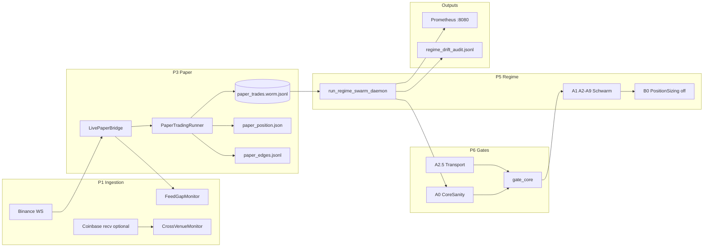

# Schwarm-Inventar — Mess-Agenten & Monitoring-Komponenten

**Stand:** 2026-08-30 · Charter: `live_execution=false` · `DEFENSIVE_CAUSAL_GROUNDING` · kein Order-Send  
**Kurz-Check:** `make raas-swarm-health` · **Laufzeit-Sync:** `make raas-swarm-inventory-sync`  
**Verwandte Docs:** [`REGIME_SWARM_LIVE_SHADOW_RUNBOOK.md`](REGIME_SWARM_LIVE_SHADOW_RUNBOOK.md) · [`REGIME_SWARM_INFRA_GATES.md`](REGIME_SWARM_INFRA_GATES.md)

> **Zwei Bedeutungen von „aktiv":** **Laufzeit** (Log-Frische, ACTIVE/STALE/…) wird aus `swarm_health.py` gemessen. **Rolle** (Shadow-Pfad, Opt-in, Cron, …) ist eine Hand-Annotation zur Architektur — kein Nachweis, dass der Prozess gerade läuft.  
> **Pre-Commit offline:** Laufzeit-Block-`generated_at` darf max. **24 h** alt sein (`SWARM_INVENTORY_MAX_AGE_H`). Inhaltliche Drift nur mit Cluster.

---

## System-Übersicht (High-Level-Architektur)

Das Repository enthält **drei Laufzeit-Ebenen**, die nicht verwechselt werden dürfen:

```text
┌─────────────────────────────────────────────────────────────────────────┐
│  RAAS Live-Shadow (Primärpfad Produktion/Monitoring)                    │
│  Binance WS → LivePaperBridge (P1/P3) → paper_trades.worm.jsonl           │
│           ↘ FeedGap / CrossVenue (Audit)                                  │
│  run_regime_swarm_daemon (P5) liest WORM → A0/A2.5 (P6) → A2–A9 Drift   │
│  Prometheus :8080 · JSONL-Audit unter /data/audit                         │
└─────────────────────────────────────────────────────────────────────────┘

┌─────────────────────────────────────────────────────────────────────────┐
│  Agent X Core NATS-Pipeline (Event-Ingest, Skalierung)                  │
│  Surface C01–C09 → D01 ZK → Infantry P01–P09 → Anvil L1                  │
│  Helm charts/agent-x · docker-compose.yml · simchain_ingest               │
└─────────────────────────────────────────────────────────────────────────┘

┌─────────────────────────────────────────────────────────────────────────┐
│  B2G Wellen 1–40 (Pipeline-Bibliothek, synchron)                        │
│  277 Agenten als Python-Orchestratoren · E2E via scripts/test_wave*.py    │
│  docker-compose B2G-Container = Platzhalter (kein --role-CLI)           │
└─────────────────────────────────────────────────────────────────────────┘
```

**Live-Shadow Datenfluss (aktuell deployt):**



---

## Übersicht aller Agenten & Schwärme

### RAAS Live-Shadow (Mess-Agenten)

#### Laufzeit-Status (auto — Log-Frische)

<!-- SWARM_RUNTIME_BEGIN -->
<!-- generated_at: 2026-08-30T17:26:10.224220+00:00 -->
<!-- generator: scripts/swarm_health.py (--sync-inventory) -->

_**Laufzeit** = Log-Frische (ACTIVE/STALE/IDLE/MISSING/OFF). **Rolle** = Architektur-Zugehörigkeit — kein Prozess-Nachweis. Sync: `make raas-swarm-inventory-sync`_

| Komponente | Schicht | Laufzeit | Alter | Signal-Pfad | Rolle (Hand) |
|------------|---------|----------|-------|-------------|--------------|
| **LivePaperBridge** | P3 | **ACTIVE** | 0s | `…/live/live/paper/runs/ethusdt/paper_trades.worm.jsonl` | Shadow-Pfad |
| **PaperTradingRunner** | P3 | **ACTIVE** | 0s | `…/live/live/paper/runs/ethusdt/paper_trades.worm.jsonl` | Shadow-Pfad |
| **FeedGapMonitor** | P1 | **MISSING** | — | `data/raas/audit/feed_gaps.jsonl (empty)` | Shadow-Pfad |
| **CrossVenueMonitor** | P1 | **STALE** | 9.2m | `regime-swarm-0:/data/audit/cross_venue_gaps.jsonl` | Opt-in (Env default off) |
| **Regime Swarm Daemon** | P5 | **ACTIVE** | 50s | `regime-swarm-0:/data/audit/regime_swarm_cycles.jsonl` | Shadow-Pfad (primary) |
| **A2 DataIngestor** | P5 | **ACTIVE** | 50s | `regime-swarm-0:/data/audit/regime_swarm_cycles.jsonl` | Shadow-Pfad |
| **A3–A9 Drift Agents** | P5 | **ACTIVE** | 49s | `regime-swarm-0:/data/audit/regime_drift_audit.jsonl` | Shadow-Pfad |
| **A0 Core Sanity Gate** | P6 | **ACTIVE** | 50s | `regime-swarm-0:/data/audit/regime_swarm_cycles.jsonl` | Shadow-Pfad |
| **A2.5 Transport Gate** | P6 | **ACTIVE** | 50s | `regime-swarm-0:/data/audit/regime_swarm_cycles.jsonl` | Shadow-Pfad |
| **B0 Position Sizing** | P5 | **OFF** | — | `data/raas/audit/position_sizing_audit.jsonl` | Opt-in (Helm off, Strang B n<50) |

_Stand: 2026-08-30T17:26:10.224220+00:00 · 7 ACTIVE · 1 STALE (Laufzeit-Zeilen, nicht Rollen-Zeilen)_

<!-- SWARM_RUNTIME_END -->

#### Architektur & Metriken (Rolle = Handlabel)

| Agent Name | Typ/Modul | Aufgabe/Metrik | Trigger/Intervall | Ziel-Log/Output | Rolle |
|------------|-----------|----------------|-------------------|-----------------|-------|
| **LivePaperBridge** | `prototypes/raas_paper_trading/paper_runner.py` | WS-Ticks → SIGNAL/SIM_FILL → WORM; integriert Exit + Feed-Gap + Cross-Venue | Dauer-Thread wenn `LIVE_FEED_ENABLED=true` | `/data/worm/live/.../paper_trades.worm.jsonl` | Shadow-Pfad |
| **PaperTradingRunner** | `prototypes/raas_paper_trading/runner.py` | Ledger, Envelope-Score, D1–D4, Option-B Exit | Pro Tick | WORM + `paper_edges.jsonl` + `paper_position.json` | Shadow-Pfad |
| **FeedGapMonitor** | `prototypes/raas_paper_trading/feed_gap.py` | Tick-Spacing + Socket-Gaps + **Heartbeat** (stündlich) | Event + Heartbeat | `/data/audit/feed_gaps.jsonl` | Shadow-Pfad |
| **CrossVenueMonitor** | `prototypes/raas_paper_trading/cross_venue.py` | 2×2 NN/LN/NL/LL nur `t_recv` + **Heartbeat je v1/v2** | Opt-in `CROSS_VENUE_ENABLED=true` | `cross_venue_gaps.jsonl` | Opt-in |
| **Regime Swarm Daemon** | `scripts/run_regime_swarm_daemon.py` | A1→A9 Drift-Pipeline, Live-Feed-Thread, Prometheus | **30s** (live-shadow) / 60s (compose) | siehe P5-Outputs | Shadow-Pfad (primary) |
| **A2 DataIngestor** | `regime_swarm/agents.py` | WORM SIGNAL → mark_price (streaming, max 10k) | Pro Zyklus | Audit-Felder in cycle report | Shadow-Pfad |
| **A3–A9 Drift Agents** | `regime_swarm/agents.py` | KS, Wasserstein, Classifier, StrategyAdapter, AuditAlert | Pro Zyklus | `regime_drift_audit.jsonl` | Shadow-Pfad |
| **A0 Core Sanity Gate** | `regime_swarm/gates/core_sanity_adapter.py` | Flash/Spread → `evaluate_gate` | Pro Zyklus vor A3 | `INFRASTRUCTURE_BLOCKED` in report | Shadow-Pfad |
| **A2.5 Transport Gate** | `regime_swarm/gates/transport_boundary.py` | Latency/Frame/Sequence M7 | Pro Zyklus | gate_block_counter A2.5 | Shadow-Pfad |
| **B0 Position Sizing** | `position_sizing/orchestrator.py` | Kelly-Boundary (Strang B) | Nach A7 wenn enabled | `position_sizing_audit.jsonl` | Opt-in (Helm off, Strang B n<50) |
| **RaaS Paper Exporter** | `services/exporter/agent_x_raas_exporter.py` | WORM → Markdown/JSON Report | systemd tägl. 23:00 UTC | `exports/reports/paper_trades_latest.md` | Cron (nicht Laufzeit-Log) |
| **Depth Ingest** | `scripts/raas_depth_ingest.py` | Binance REST L2 → Depth-WORM | systemd **60s** | `logs/worm/depth_snapshots.jsonl` | Ops-Template (nicht Shadow-Pod) |

### RAAS Offline / Studie / Smoke

| Agent Name | Typ/Modul | Aufgabe/Metrik | Trigger | Output | Status |
|------------|-----------|----------------|---------|--------|--------|
| **Paper Collect** | `scripts/raas_paper_collect.py` | 24h-Paper-Loop mit Depth | `make raas-paper-collect` | `logs/worm/paper_runs/` | **Aktiv** (Batch) |
| **Regime Drift Monitor** | `scripts/raas_regime_drift_monitor.py` | Einmaliger A1–A9-Lauf | CLI | `exports/reports/regime_drift_latest.json` | **Aktiv** (one-shot) |
| **Flash-Crash Retro** | `scripts/raas_flash_crash_retrospective.py` | Historische Klines vs Gate | CLI | `flash_crash_retrospective.jsonl` | **Aktiv** (screen) |
| **FN Belt / Barrier Cal** | `scripts/raas_fn_belt_screen.py`, `raas_barrier_cal_surface.py` | Diagnostik A–D / FP-FN | CLI | JSON reports | **Aktiv** (diagnostic) |
| **Recover RT Abort** | `scripts/recover_regime_swarm_rt_abort.py` | OOM/Crash: IDLE + RESTART_MARKER | Manuell (Ops) | WORM + feed_gaps | **Aktiv** (ops) |
| **Agent X Core Paper** | `scripts/paper_trading_agent_x.py` | 6-Klassen SymbolicsAgent | `--interval 30` | `reports/pt_*.jsonl` | **Legacy** |

### Agent X NATS-Pipeline (Event-Ingest)

| Agent Name | Typ/Modul | Aufgabe/Metrik | Trigger | Output | Status |
|------------|-----------|----------------|---------|--------|--------|
| **Surface C01–C09** | `agents/surface/run_agent.py` | NATS Queue-Group, ZK-Trigger, TPS | Dauer-Daemon | `agentx.surface.events` → D01 | **Aktiv** |
| **D01 Mock ZK Responder** | `scripts/mock_d01_responder.py` | Groth16-Mock, L1-Anvil | 8 Repl. Compose | ZK proofs, quarantine | **Aktiv** |
| **Infantry P01–P09** | `agents/mechanized/handler.py` | Edge-Clearance | NATS consumer | `agentx.infantry.cleared` | **Aktiv** |
| **Air Layer A01–A09** | `agents/air/` | Soft-Finality, CAS, Poison | In-process / NATS | EventBus | **Aktiv** (Library) |
| **SimChain Ingest** | `scripts/simchain_ingest.py` | Load-Gen 96k–1M evt/s | Batch/Benchmark | NATS surface.events | **Aktiv** (Benchmark) |
| **Chaos F07–F09** | `chaos/docker-compose.chaos.yml` | Killer/Throttler/Poison | Chaos Compose | Container stress | **Aktiv** (Chaos) |

### HTTP-Services & Gates

| Agent Name | Modul | Aufgabe | Port | Status |
|------------|-------|---------|------|--------|
| **Z3 Solver / Compliance Gate** | `services/z3_solver/main.py` | BHO-Invariante, BSI K1–K8 `/compliance` | :8000 | **Aktiv** (B2G-primary) |
| **Fail-Closed Gate** | `services/fail_closed_gate/main.py` | `/v1/evaluate`, HUMAN_GATE | HTTP | **Aktiv** |
| **gate_core** | `services/fail_closed_gate/gate_core.py` | P3/P6/P8/M7/BHO lokal | Library | **Aktiv** |
| **Agent X API v3** | `api/main.py` | Evaluate, Jobs, Billing | :8080 | **Aktiv** |
| **Agent X Metrics** | `agent_x_metrics.py` | 36+ Prometheus Gauges | :9090 | **Aktiv** |
| **Telemetry Ingest** | `services/telemetry_ingest/main.py` | ESP32 MQTT/HTTP | :8000 | **Aktiv** (IoT) |
| **Chaos Matrix** | `services/chaos_matrix.py` | 10 Attack × Z3 Intercept | Demo | **Aktiv** (Demo) |
| **MultiChain API** | `services/multichain_api.py` | Chain REST | :8600 | **Aktiv** |

### B2G Wellen (Pipeline — testbar, kein Dauer-Daemon)

| Welle | Orchestrator | Agenten | Test-Suite | Status |
|-------|--------------|---------|------------|--------|
| 1–10 Procurement Core | `orchestrator_b2g_full.py` | 81 (+9 VOB/B) | `scripts/end_to_end_90_agents.py` | **Aktiv** (Pipeline) |
| 15–33 Erweiterung | `*_orchestrator.py` je Welle | 9×N + Subagenten | `scripts/test_wave*.py` | **Aktiv** (Pipeline) |
| 34 Finale | `finale/finale_orchestrator.py` | 1+3 + Streamlit | `scripts/test_finale.py` | **Aktiv** |
| 35–37 SimChain/Demo | `simchain/`, `multichain/`, `demo/` | Multi-chain sim | `test_simchain.py` etc. | **Aktiv** (Sim) |
| 38–40 Diagnostic | `diagnostic/`, `ethical_boundary/`, `resilience/` | 9+ je Welle | 281+82+105 Tests | **Aktiv** (Gate/Pipeline) |
| Compliance | `compliance/rpa_main_orchestrator.py` | 23 Sub + 2 Orch | E2E B2G | **Aktiv** |
| Wave 6 Invoicing | — | 9 geplant | — | **Legacy/Stub** (Modul fehlt) |
| Compose B2G ×81 | `docker-compose.yml` | Container ohne `--role` | — | **Legacy/Stub** |

### Emergence-Studien (nur Scripts)

| Schwarm | Modul | Test | Status |
|---------|-------|------|--------|
| Wirtschafts-Schwarm | `agents_b2g/wirtschaft/` | `scripts/test_wirtschaft_*.py` | **Studie** |
| Rescue-Koordination | `agents_b2g/rescue/` | `scripts/test_rescue*.py` | **Studie** |
| CI-Resilienz | `agents_b2g/ci/` | `scripts/test_ci_*.py` | **Studie** |
| Humanitäre Logistik | `agents_b2g/humanitarian/` | `scripts/test_hum_*.py` | **Studie** |
| Smart Grid | `agents_b2g/smartgrid/` | `scripts/test_smartgrid_*.py` | **Studie** |

---

## Zuordnung zu den RAAS-Schichten

### P1 — Signal Ingestion & Feeds

| Komponente | Metrik / Claim | Output |
|------------|----------------|--------|
| `feed.py` — BinanceWebSocketFeed | mark_price, trade ticks | `PaperTick` |
| `feed.py` — CoinbaseMatchRecvFeed | `t_recv` pulses (Cross-Venue V2) | RecvPulse |
| `depth_snapshot.py` + `raas_depth_ingest.py` | L2 depth, snapshot_age_s | `depth_snapshots.jsonl` |
| `feed_gap.py` — FeedGapMonitor | gap_duration_s, source tick_spacing/socket/**heartbeat** | `feed_gaps.jsonl` |
| `scripts/audit_feed_gap_worm.py` | W-Studie: WORM-SIGNAL Δt → null_gaps_proven (≥80 % Abdeckung) / writer_failed / **INSUFFICIENT_COVERAGE**; Default-Fensterstart Dual-Start W `2026-08-29T13:17:46Z` | stdout JSON |
| `cross_venue.py` — CrossVenueMonitor | 2×2 cell, onset_skew_s | `cross_venue_*.jsonl` |
| `ingest_public_distributions.py` | Public kline distributions | Cache unter `logs/` |

**Env:** `LIVE_FEED_*`, `PAPER_FEED_GAP_*`, `CROSS_VENUE_*`, `RAAS_DEPTH_WORM_PATH`

### P3 — Simulation & Paper-Trading Engine

| Komponente | Metrik / Claim | Output |
|------------|----------------|--------|
| `runner.py` — PaperTradingRunner | SIGNAL, SIM_FILL, envelope hit-rate | `paper_trades.worm.jsonl` |
| `ledger.py` | cash_eur, equity_eur, position_qty | WORM-Felder |
| `slippage.py` | fixed / orderbook-walk slippage | WORM-Felder |
| `paper_exit.py` | Option B: hold_seconds, gap, single-position | `paper_position.json`, `paper_edges.jsonl` |
| `envelope_score.py` | break-prediction precision/recall | Post-run JSON |
| `worm_log.py` + `worm_io.py` | Hash-chain append-only | WORM JSONL |
| `raas_paper_collect.py` | Long-run paper simulation | `paper_runs/{run_id}/` |

**Env:** `PAPER_EXIT_*`, `PAPER_HOLD_SECONDS`, `PAPER_EDGES_PATH`, `RAAS_DATA_ROOT`

### P5 — Causal Grounding & Market Regimes

| Komponente | Metrik / Claim | Output |
|------------|----------------|--------|
| `regime_drift.py` | KS, Wasserstein, permutation p | — |
| `regime_swarm/orchestrator.py` — A1 | 9-Agent Pipeline, MEHI-adjacent drift | `regime_drift_audit.jsonl` |
| A2–A9 (`agents.py`) | classified_regime, drift_type, risk_multiplier | cycle report |
| `adaptive.py` | Cooling-off, dynamic window, stuck telemetry | `regime_swarm_cooling.jsonl` |
| `leader.py` / `lease_k8s.py` | Single-leader invariant | `leader_snapshot.json` |
| `position_sizing/` — B0–B8 | Kelly γ, sizing_gate (Strang B) | `position_sizing_audit.jsonl` |

**Daemon-Outputs (`SWARM_DATA_ROOT=/data`):**

| Pfad | Inhalt |
|------|--------|
| `/data/audit/regime_drift_audit.jsonl` | A9 Audit pro Zyklus |
| `/data/audit/regime_swarm_cycles.jsonl` | Cycle summaries |
| `/data/state/regime_swarm_cooling.jsonl` | Unreliable/real-drift counters |
| `/data/state/swarm_state.json` | Soft multipliers persistiert |
| `/data/state/leader_snapshot.json` | Leader advisory state |
| `/data/reports/regime_drift_latest.json` | Latest summary |
| `/tmp/swarm_heartbeat` | Liveness (HEALTHCHECK) |
| `:8080/metrics` | Prometheus (swarm_cycles_total, drift_counter, …) |

### P6 — Z3 Risk-Gate & Safety Invariants

| Komponente | Metrik / Claim | Output |
|------------|----------------|--------|
| `gates/core_sanity_adapter.py` — A0 | G0 price/spread chaos | BLOCKED/RELEASED |
| `gates/transport_boundary.py` — A2.5 | G25 latency/frame poison | BLOCKED/RELEASED |
| `gate_core.py` | P3_EXEC_RISK, P8_CASCADE, M7, BHO | evaluate() verdict |
| `leader_fsm_z3.py` | I1: leaders_count ≤ 1 | Z3 proof dict |
| `services/z3_solver/main.py` | BHO Δ=0, BSI compliance K1–K8 | `/compliance`, `/prove_bho_invariant` |
| `d_suite_enforcer.py` | D1–D4 application barriers | WORM anchor |

**Env:** `SWARM_INFRA_GATES_*`, `G0_MAX_*`, `G25_MAX_LATENCY_MS`

### Exporter & WORM Audit-Logger

| Komponente | Trigger | Output |
|------------|---------|--------|
| `agent_x_raas_exporter.py` — paper mode | Daily / `make raas-paper-report` | `exports/reports/paper_trades_latest.md` |
| `agent_x_raas_exporter.py` — b2b mode | CLI | Gutachten JSON/PDF/Merkle |
| `raas_portal/exporter.py` | P9 stress certificate | Tenant-scoped audit |
| `recover_regime_swarm_rt_abort.py` | Ops recovery | RESTART_MARKER in WORM + feed_gaps |
| `event_bus.py` | Pub/Sub audit | JSONL EventBus |

---

## Konfigurations-Pfade & Deployment-Dateien

### RAAS Regime-Swarm (Live-Shadow)

| Datei | Zweck | Agent(en) |
|-------|-------|-----------|
| `charts/regime-swarm/values-live-shadow.yaml` | **Primary** Live-Shadow Overlay | Daemon + LivePaperBridge + Feed-Gap + Exit |
| `charts/regime-swarm/values-dev.yaml` | Dev: 30s cycle, 1 replica | Daemon |
| `charts/regime-swarm/values-shadow.yaml` | HA: 2 replicas + K8s Lease | Daemon + Leader |
| `charts/regime-swarm/templates/statefulset.yaml` | StatefulSet + PVC `/data` | regime-swarm-0 |
| `charts/regime-swarm/templates/configmap.yaml` | Env aus `values*.yaml` → Pod | Alle RAAS Env |
| `config/regime_swarm.json` | cycle_interval_seconds=60, metrics_port=8080 | Daemon defaults |
| `config/regime_swarm.env.example` | Env-Dokumentation | — |
| `config/paper_trading_config.json` | Fees, slippage, depth_ingest | Paper + Depth |
| `Dockerfile.regime-swarm` | Prod image (feed-gap-v2) | Daemon entrypoint |
| `docker-compose.regime-swarm.yml` | Local compose, 60s cycle | Daemon |
| `docker-compose.regime-swarm-shadow.yml` | 2-replica HA drill | Daemon |
| `docker-compose.regime-swarm-smoke.yml` | Infra smoke job | A0/A2.5 smoke |
| `deploy/systemd/raas-depth-ingest.{service,timer}` | 60s depth cron | Depth Ingest |
| `deploy/systemd/raas-paper-exporter.{service,timer}` | Daily 23:00 report | RaaS Exporter |

**Image-Sollzustand Live-Shadow:** `agentx-regime-swarm:feed-gap-v2` (WORM tail-seek OOM fix)

### Agent X NATS / Skalierung

| Datei | Agent(en) |
|-------|-----------|
| `charts/agent-x/values.yaml` | Surface, D01, Infantry KEDA |
| `charts/agent-x/templates/surface-deployment.yaml` | C01–C09 |
| `charts/agent-x/templates/d01-worker-deployment.yaml` | D01 ×8 |
| `charts/agent-x/templates/infantry-deployment.yaml` | P01–P09 |
| `docker-compose.yml` | Full stack (109+ services, B2G stubs) |
| `docker-compose.mock.yml` | Z3 + Bunker mock stack |
| `docker-compose.production.yml` | API + metrics |
| `config/prometheus.yml` | Scrape targets |

### B2G & Z3

| Datei | Agent(en) |
|-------|-----------|
| `services/z3_solver/Dockerfile.z3` | Z3 Compliance Gate |
| `docker-compose.mock.yml` → `z3_solver_engine` | Z3 service |
| `orchestrator_b2g_full.py` | Waves 1–9 pipeline |
| `cli_b2g_query.py` | Wave 10 query agents |

### CI / Smoke

| Workflow / Script | Prüft |
|-------------------|-------|
| `.github/workflows/regime-swarm-helm.yml` | Helm lint, Z3 leader, infra gates |
| `.github/workflows/cluster-smoke-cron.yml` | Weekly Kind cluster smoke |
| `scripts/run_regime_swarm_cluster_smoke.sh` | G0 baseline + override |
| `scripts/run_regime_swarm_infra_smoke.py` | WORM → A0/A2.5 |
| `scripts/test_worm_streaming_oom.py` | OOM regression |
| `scripts/test_cross_venue_connectivity.py` | Cross-venue 2×2 smoke |
| `scripts/test_feed_gap_concordance.py` | Feed-gap Pre-Reg smoke |

---

## Makefile-Schnellreferenz (RAAS)

| Target | Schicht | Komponente |
|--------|---------|------------|
| `raas-regime-swarm-daemon` | P5 | Foreground daemon |
| `raas-regime-swarm-live-shadow-install` | P1+P3+P5 | Helm live-shadow |
| `raas-paper-trading-smoke` | P3 | Paper smoke |
| `raas-feed-gap-smoke` | P1 | Feed-gap concordance |
| `raas-feed-gap-worm-audit` | P1 | W-Studie WORM Δt vs Schreiber |
| `raas-cross-venue-smoke` | P1 | Cross-venue 2×2 |
| `raas-worm-streaming-oom-smoke` | P5 | OOM regression |
| `raas-swarm-health` | Ops | Terminal-Status aktiver Logs/Agenten |
| `raas-swarm-inventory-sync` | Ops | Laufzeit-Block in SWARM_INVENTORY.md schreiben |
| `raas-regime-drift-monitor` | P5 | One-shot drift |
| `raas-paper-report` | Export | Daily report |
| `raas-depth-ingest` | P1 | Depth WORM |

---

## Status-Legende

### Laufzeit (auto, `swarm_health.py`)

| Label | Bedeutung |
|-------|-----------|
| **ACTIVE** | Log/State jünger als Schwellwert (typ. 120s bei 30s-Zyklus) |
| **STALE** | Schreibt noch, aber > Schwellwert und ≤ 6× Schwellwert |
| **IDLE** | Datei existiert, aber zu alt für „gerade aktiv" |
| **MISSING** | Pflicht-Signal fehlt (Prozess vermutlich aus) |
| **OFF** | Opt-in-Pfad absichtlich nicht aktiv (Env default off) |

### Rolle (Hand — Architektur, nicht Prozess)

| Label | Bedeutung |
|-------|-----------|
| **Shadow-Pfad** | Gehört zum Live-Shadow-Stack (Deploy-Ziel) |
| **Opt-in** | Code fertig, Env/Helm default off |
| **Cron** | Zeitgesteuert, kein Dauer-Daemon |
| **Batch/Demo** | Manuell / Make-Target |
| **Ops** | Recovery / Runbook only |
| **Legacy** | Ersetzt oder nur historisch |
| **Legacy/Stub** | Compose/Doc referenziert, Code fehlt oder maskiert |
| **Studie** | Nur Forschungs-Scripts, kein Produktionspfad |
| **Pipeline** | On-demand Orchestrator, kein Dauer-Daemon |

---

## Siehe auch

- [`REGIME_SWARM_LIVE_SHADOW_RUNBOOK.md`](REGIME_SWARM_LIVE_SHADOW_RUNBOOK.md)
- [`REGIME_SWARM_INFRA_GATES.md`](REGIME_SWARM_INFRA_GATES.md)
- [`COMPLIANCE_PLAYBOOK.md`](COMPLIANCE_PLAYBOOK.md)
- [`WORM_DAILY_POE_PREREG.md`](WORM_DAILY_POE_PREREG.md) (Draft)
