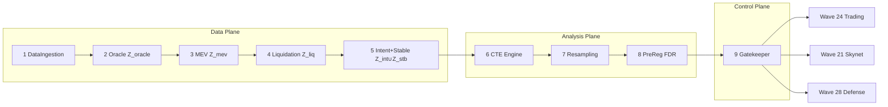

# Wave 38 — Causal Audit & Signal Guard

**Status:** Implementierungs-Spezifikation (2026-08-22)  
**Modul:** `agents_b2g/diagnostic/`  
**Charakter:** Querliegende Validierungs-Welle (analog Compliance-Modul — nicht funktional wie Tendering/Treasury)  
**Skala:** 9 Hauptagenten × 9 Subagenten = **81 Subagenten**  
**Bridge-Studie:** `docs/BRIDGE_DIAGNOSTIC_ERGEBNIS.md` (versiegelt, **read-only Referenz**)  
**Operative Pre-Reg (Pflicht für Live-Läufe):** `docs/WAVE38_LIVE_PREREG.md` (neu, vor erstem Produktionslauf)  
**Methodik-Referenz (nicht operative Pre-Reg):** `docs/BRIDGE_DIAGNOSTIC_PREREG.md`, `docs/BRIDGE_STUFE_A_V3_PREREG.md`

---

## 0. Wissenschaft vs. Betrieb

| Aspekt | Bridge-Serie (A → v2 → v3 → Diagnostic) | Wave 38 (Live) |
|--------|----------------------------------------|----------------|
| Zweck | Wissenschaftliche Falsifikation, präregistriert | Operatives Monitoring, Signalfreigabe |
| Evidenz | Erzeugt neue, versiegelte Ergebnis-Dossiers | **Erzeugt keine neue wissenschaftliche Evidenz** |
| Pre-Reg | Bindend pro Studie (`BRIDGE_*_PREREG.md`) | **Eigene** operative Pre-Reg pro Deployment (`WAVE38_LIVE_PREREG.md`) |
| Artefakte | `bridge_stufe_a_v3_ergebnis.json`, `bridge_diagnostic_*.json` | Neue Live-Captures unter `{data_root}/{user_id}/wave38/` |
| Rechengrundlage | Historisches 90-Tage-Fenster (versiegelt) | Rolling-Fenster, eigene Seeds, eigene Schwellen |

**Read-only-Regel (zwingend):** Wave 38 darf versiegelte Bridge-Artefakte **laden und referenzieren** (Methodik, Schwellen-Vorschläge, Rollen-Klassifikation als Benchmark), aber **nicht neu berechnen, überschreiben oder uminterpretieren**. Die Serie bleibt methodische Referenz — nicht Rechengrundlage für RELEASED/BLOCKED.

---

## 1. Architektur-Übersicht

### 1.1 Drei Funktionsebenen

| Ebene | Hauptagenten | Funktion |
|-------|--------------|----------|
| **Data Plane** | 1–5 | Blockchain-Ingestion, `Z_neu`-Capture (Oracle, MEV, Liquidationen, Intent/Stablecoin) |
| **Analysis Plane** | 6–8 | CTE-Berechnung, Resampling/Invarianz, Pre-Reg/FDR-Guard |
| **Control Plane** | 9 | Gatekeeper: `S(τ)`-Aggregation → `RELEASED`/`BLOCKED` für Hauptschwarm |

Agent 9 ist der **einzige Ausgang** der Welle. Abhängigkeitsrichtung bleibt **azyklisch**: Wave 38 liefert an 24/21/28; optionale Rückkanäle (Skynet-Score, Perimeter-Alerts) sind **deskriptiv**, nicht verdict-tragend.

### 1.2 9-Stufen-Pipeline

Konsistent mit Wave 27 (Clearing), Wave 17 (MacroEconomy):

```
Stage 1  DataIngestionAgent       →  Stage 2  OracleSignalAgent
Stage 3  MEVClusterAgent           →  Stage 4  LiquidationCascadeAgent
Stage 5  IntentAndStablecoinAgent →  Stage 6  CTEEntropyEngineAgent
Stage 7  ResamplingInvarianceAgent →  Stage 8  PreRegFDRGuardAgent
Stage 9  GatekeeperDispatcherAgent
```



### 1.3 Modul-Layout

```
agents_b2g/diagnostic/
├── __init__.py                          # exports CausalAuditOrchestrator, Wave38Supervisor
├── causal_audit_orchestrator.py         # Root: 9-Stufen-Sequenz + Supervisor
├── config.py                            # Wave38Config, env, LIVE_PRE_REG_PATH
├── types.py                             # Envelopes, StageContext, DiagnosticSignalEnvelope
├── agents/
│   ├── data_ingestion_agent.py          # Agent 1 + Subagent-Registry
│   ├── oracle_signal_agent.py           # Agent 2
│   ├── mev_cluster_agent.py             # Agent 3
│   ├── liquidation_cascade_agent.py     # Agent 4
│   ├── intent_stablecoin_agent.py       # Agent 5
│   ├── cte_entropy_engine_agent.py      # Agent 6
│   ├── resampling_invariance_agent.py   # Agent 7
│   ├── pre_reg_fdr_guard_agent.py       # Agent 8
│   └── gatekeeper_dispatcher_agent.py   # Agent 9
├── subagents/                           # 81 Dateien (s1_*.py … s9_*.py oder flach benannt)
│   ├── eth_block_scanner.py
│   ├── …
│   └── dispatcher_telemetry.py
├── confirmatory.py                      # Bridge-Studie (historisch, read-only Pfad)
└── informativity_gate.py                # Gate-Logik (wiederverwendbar)

scripts/
├── wave38_pipeline.py                   # CLI Live-Betrieb
├── test_wave38_diagnostic.py            # 9 Gruppen + E2E + Config
└── end_to_end_wave38.py                 # Vollständiger Pipeline-Smoke

docs/
├── WAVE38_DIAGNOSTIC_SPEC.md            # dieses Dokument
├── WAVE38_LIVE_PREREG.md                # operative Pre-Reg (vor Go-Live)
├── BRIDGE_DIAGNOSTIC_ERGEBNIS.md        # versiegelt, Referenz
└── BRIDGE_DIAGNOSTIC_SPEC.md            # historische 9-Agenten-Studien-Spec
```

**Reuse (keine Duplikation der Mathematik):**

| Modul | Funktion |
|-------|----------|
| `scripts/bridge_stufe_a_stats.py` | `transfer_entropy_binary`, `benjamini_hochberg` |
| `scripts/bridge_stufe_a_v3_pipeline.py` | `encode_z_neu_tertile`, `cte_observed_grid` |
| `agents_b2g/diagnostic/informativity_gate.py` | Terzil-Dispersion, `INERT_ENCODING` |
| `agents_b2g/diagnostic/confirmatory.py` | Referenz-Implementierung LOO/Perm (nicht Live-Pfad) |

---

## 2. Shared Types & Envelopes

### 2.1 Standard-Agent-Response (`AgentEnvelope`)

Identisch zu Wave 17/20/27 — alle Haupt- und Subagenten:

```python
class AgentEnvelope(TypedDict):
    status: Literal["started", "completed", "failed"]
    job_id: str
    artifacts: list[ArtifactRef]
    error: str | None
    logs: list[str]
```

### 2.2 Stage-Kontext (Pipeline-weit)

```python
@dataclass
class Wave38RunInput:
    run_id: str
    user_id: str
    live_pre_reg: str                    # Pfad zu WAVE38_LIVE_PREREG.md (bindend)
    reference_artifacts: ReferenceArtifacts  # read-only Bridge-JSONs, optional
    window: TimeWindow                   # UTC start/end, minute grid
    chains: tuple[Literal["ethereum", "gnosis"], ...]
    options: Wave38RunOptions

@dataclass
class StageContext:
    run: Wave38RunInput
    job_id: str
    data_root: Path                      # {DATA_ROOT}/{user_id}/wave38/{job_id}/
    stage_outputs: dict[str, Any]      # akkumuliert pro Stage
    pre_reg_constants: PreRegConstants # aus Agent 8, nach Bindung geladen
```

### 2.3 Subagent-Ergebnis

```python
@dataclass
class SubagentResult:
    subagent_id: str                     # z.B. "W38-A2-S3"
    status: Literal["ok", "skipped", "failed"]
    metrics: dict[str, float | int | str]
    artifacts: list[ArtifactRef]
    error: str | None = None
```

**Konvention:** Jeder Subagent implementiert:

```python
def run(self, ctx: StageContext) -> SubagentResult: ...
```

Jeder Hauptagent aggregiert 9 Subagent-Ergebnisse und liefert `AgentEnvelope`.

---

## 3. Signal-Envelope (Agent 9 — nicht verhandelbar)

Wave 24/28/21 benötigen **kein Bool**, sondern ein interpretierbares Verdict-Paket.

### 3.1 Typen

```python
class BlockCause(str, Enum):
    FILTER_ARTIFACT = "FILTER_ARTIFACT"   # Permutation bricht nicht zusammen
    INERT_ENCODING = "INERT_ENCODING"     # Konditionierer gesättigt / Terzil kollabiert
    FDR_FAIL = "FDR_FAIL"                 # BH-FDR q=0.05 nicht gehalten
    INCONCLUSIVE = "INCONCLUSIVE"           # unclassified > 0, Grauzone
    INFRA_DOMINATED = "INFRA_DOMINATED"     # Ex-Post: FP_infra dominiert (optional Phase 2)

class DiagnosticVerdict(str, Enum):
    DIAG_SIGNAL_VALID = "DIAG_SIGNAL_VALID"
    DIAG_FILTER_ARTIFACT = "DIAG_FILTER_ARTIFACT"
    DIAG_INCONCLUSIVE = "DIAG_INCONCLUSIVE"
    DIAG_OVERCONSERVATIVE = "DIAG_OVERCONSERVATIVE"   # Ex-Post optional
    DIAG_INFRA_DOMINATED = "DIAG_INFRA_DOMINATED"   # Ex-Post optional

@dataclass
class FDRResult:
    n_tests: int
    q: float
    n_rejected: int
    bh_adjusted_p: dict[str, float]      # test_id → p_adj
    passed: bool

@dataclass
class CollapseInfo:
    perm_fail_candidates: list[str]
    perm_collapse_by_candidate: dict[str, float]
    inert_candidates: list[str]
    cleansing_workers: list[str]

@dataclass
class ReleasedSignal:
    candidate_id: str
    direction: Literal["ab", "ba"]
    s_tau: float
    peak_lag_min: int | None
    role: Literal["cleansing_worker", "neutral"]

@dataclass
class BlockedSignal:
    candidate_id: str
    direction: Literal["ab", "ba"]
    cause: BlockCause
    detail: str                          # menschenlesbar, für Wave 28

@dataclass
class DiagnosticSignalEnvelope:
    """Einziger extern sichtbarer Output von Wave 38."""
    verdict: DiagnosticVerdict
    gate_action: Literal["RELEASED", "BLOCKED"]
    s_tau: dict[str, dict[str, float]]   # candidate_id → {ab, ba} aggregiert
    fdr_status: FDRResult
    collapse_info: CollapseInfo
    released_signals: list[ReleasedSignal]
    blocked_signals: list[BlockedSignal]
    cause: BlockCause | None             # Pflicht wenn gate_action == BLOCKED
    run_id: str
    live_pre_reg_hash: str               # SHA3-256 der bindenden Pre-Reg
    timestamp_utc: str
    reference_only: list[str]            # Pfade zu read-only Bridge-Artefakten, falls geladen
```

### 3.2 Gatekeeper-Constraints (Pflicht)

1. **`RELEASED` ohne Envelope verboten.** Mindestens: `verdict`, `s_tau`, `fdr_status`, `collapse_info`, `released_signals`.
2. **`BLOCKED` ohne `cause` verboten.** Wave 28 darf `FILTER_ARTIFACT` von echter Bedrohung trennen.
3. **Payload über `AgentMessage`:** neuer `PayloadType.DIAGNOSTIC_SIGNAL` in `agents_b2g/protocol.py` mit `content=DiagnosticSignalEnvelope.model_dump()`.

### 3.3 Aggregation `S(τ)` (Agent 9, Subagent SignalAggregator)

```python
def aggregate_s_tau(
    cte_grids: dict[str, dict[str, list[float]]],  # candidate → direction → CTE(τ)
    *,
    method: Literal["sum_peak", "max_lag"] = "sum_peak",
) -> dict[str, dict[str, float]]:
    """Summe über Lags oder Peak-Lag-Wert je Richtung ab/ba."""
```

Default Live: `sum_peak` — konsistent mit V3-Sensitivitäts-Summen (`S_ref`).

---

## 4. Verdrahtung zu Wave 24 / 21 / 28

| Ziel | Richtung | Payload | Zweck |
|------|----------|---------|-------|
| Wave 24 (Trading) | **Out** | `released_signals`, `s_tau`, `verdict` | Signalfreigabe; `BLOCKED` unterdrückt Trades auf Rausch-Korrelation |
| Wave 21 (Skynet) | **Out** | `causal_score`, `cleansing_workers`, `inert_candidates` | Zusätzliche Dashboard-Säule (deskriptiv, nicht BLOCKING) |
| Wave 28 (Defense) | **Out** | `blocked_signals`, `cause` | Bedrohungslage mit Ursache — `FILTER_ARTIFACT` ≠ Sybil-Angriff |
| Wave 21 (Skynet) | In (optional) | `{skynet_6pillar_score}` | Kontext für Telemetrie, **nicht verdict-tragend** |
| Wave 28 (Defense) | In (optional) | `{perimeter_alerts}` | Kontext für MEV-Dichte-Abgleich, **nicht verdict-tragend** |

### 4.1 Bridge-Subagenten (Agent 9)

| Subagent | Signatur | Output |
|----------|----------|--------|
| `Wave24Bridge` | `emit_trading(ctx, envelope) -> SubagentResult` | NATS/EventBus → `MEVAndSlippageProtectionAgent`, `TradingAnalyticsAndRiskMonitor` |
| `Wave21Bridge` | `emit_skynet(ctx, envelope) -> SubagentResult` | `causal_score = f(verdict, n_cleansing, perm_pass_rate)` ∈ [0, 100] |
| `Wave28Bridge` | `emit_defense(ctx, envelope) -> SubagentResult` | Nur `blocked_signals` mit `cause != None` |

### 4.2 Skynet `causal_score` (deskriptiv)

```python
def causal_score(envelope: DiagnosticSignalEnvelope) -> float:
    if envelope.verdict == DiagnosticVerdict.DIAG_SIGNAL_VALID:
        base = 85.0
    elif envelope.verdict == DiagnosticVerdict.DIAG_INCONCLUSIVE:
        base = 50.0
    else:
        base = 25.0
    penalty = 5.0 * len(envelope.collapse_info.perm_fail_candidates)
    return max(0.0, min(100.0, base - penalty))
```

Schwellen und Gewichte **nur** in `WAVE38_LIVE_PREREG.md` — nicht hardcoden ohne Pre-Reg.

---

## 5. Neun Hauptagenten × neun Subagenten

Notation: **W38-A{n}-S{m}** = Wave 38, Agent n, Subagent m.

### Stage 1 — `DataIngestionAgent` (RPC & Raw Capture)

| ID | Subagent | Funktion |
|----|----------|----------|
| S1 | `EthBlockScanner` | Ethereum-Mainnet-Blockscan, dynamic throttling |
| S2 | `GnosisBlockScanner` | Gnosis-Chain-Blockscan, RPC-Fallback |
| S3 | `ReceiptFetcher` | `eth_getBlockReceipts`-Batch-Orchestrierung |
| S4 | `ChunkCoordinator` | Chunk-Größen-Adaption bei Range-Fehlern |
| S5 | `RetryScheduler` | Exponentieller Backoff bei 429/503 |
| S6 | `RPCLoadBalancer` | Fallback-Kette (publicnode → gnosischain → drpc) |
| S7 | `CheckpointWriter` | Resume bei Abbruch |
| S8 | `RawEventStorer` | SQLite-Write, Dedup `(chain, tx, logIndex)` |
| S9 | `IngestionTelemetry` | blk/s, skip_allow, ETA |

```python
class DataIngestionAgent:
    def run(self, ctx: StageContext) -> AgentEnvelope:
        ...

# W38-A1-S1
class EthBlockScanner:
    def run(self, ctx: StageContext) -> SubagentResult:
        """Input: ctx.run.window, ctx.run.chains[0].
        Output artifact: raw_blocks_eth.sqlite, metrics: {blocks_fetched, blk_per_s}."""
```

**Stage-1-Output:** `ctx.stage_outputs["ingestion"] = {raw_db_path, checkpoint_path, telemetry}`

---

### Stage 2 — `OracleSignalAgent` (`Z_oracle`)

| ID | Subagent | Funktion |
|----|----------|----------|
| S1 | `ChainlinkProxyResolver` | `aggregator()` + `phaseAggregators()` |
| S2 | `AggregatorPhaseTracker` | Migrations-Historie im Fenster |
| S3 | `AnswerUpdatedParser` | Topic0-Decode, int256-Normalisierung |
| S4 | `FeedPlausibilityGate` | `latestRoundData`-Band-Check |
| S5 | `OROccupancyBuilder` | Minute-Bins, OR über Feeds |
| S6 | `FeedExclusionEnforcer` | USDT-ETH, GNO-ETH hard block |
| S7 | `OracleTelemetry` | Event-Zählungen, Coverage |
| S8 | `OracleIntegrityChecker` | Zeitfenster, Dedup |
| S9 | `OracleStateArchiver` | WORM Occupancy-Serie |

```python
class OracleSignalAgent:
    def run(self, ctx: StageContext) -> AgentEnvelope: ...

class ChainlinkProxyResolver:
    def run(self, ctx: StageContext) -> SubagentResult:
        """Input: ingestion raw_db, docs/ABI registry.
        Output: proxy_map.json, verified_addresses[]. Dreistufig: Docs→ABI→On-Chain."""
```

**Coverage-vs-Informativität (V3 §8):** Agent 2/S4 + Agent 8/InformativityGate — binäre Occupancy allein reicht nicht; Terzil-Dispersion muss geprüft werden.

---

### Stage 3 — `MEVClusterAgent` (`Z_mev`)

| ID | Subagent | Funktion |
|----|----------|----------|
| S1 | `TxFromExtractor` | Top-Level-TX, status=1 |
| S2 | `AddressNormalizer` | Lowercase, EIP-55 strip |
| S3 | `ExclusionListApplier` | 63 Bridge/Relayer/Protokoll-Adressen |
| S4 | `CrossChainMatcher` | `t // 60`-Join ETH+Gnosis |
| S5 | `EOACodeChecker` | `eth_getCode`-Batch |
| S6 | `MinuteOccupancyBuilder` | Sparse JSONL |
| S7 | `MEVTelemetry` | Cross-Chain-EOA-Zählung |
| S8 | `MEVIntegrityChecker` | Zeitfenster-Validierung |
| S9 | `MEVStateArchiver` | WORM-Archiv |

```python
class MEVClusterAgent:
    def run(self, ctx: StageContext) -> AgentEnvelope: ...

class ExclusionListApplier:
    def run(self, ctx: StageContext) -> SubagentResult:
        """Input: config/exclusion_list.json (Live Pre-Reg Anhang).
        Output: filtered_addresses.json, metrics: {n_excluded}."""
```

---

### Stage 4 — `LiquidationCascadeAgent` (`Z_liq`)

| ID | Subagent | Funktion |
|----|----------|----------|
| S1 | `AaveV3PoolScanner` | ETH + Gnosis Pools |
| S2 | `SparkPoolScanner` | ETH + Gnosis Pools |
| S3 | `LiquidationCallParser` | 7-Param-Decode, Topic0 keccak |
| S4 | `ReservesListVerifier` | Schicht-B View-Funktionen |
| S5 | `PoolAddressRegistry` | Address-Book-Abgleich |
| S6 | `CascadeOccupancyBuilder` | OR über Pools |
| S7 | `LiqTelemetry` | Pool-spezifische Zählungen |
| S8 | `LiqIntegrityChecker` | Zeitfenster |
| S9 | `LiqStateArchiver` | WORM |

```python
class LiquidationCallParser:
    def run(self, ctx: StageContext) -> SubagentResult:
        """Input: raw logs, signature registry (keccak verified).
        Output: liquidations.jsonl minute occupancy."""
```

---

### Stage 5 — `IntentAndStablecoinAgent` (`Z_intent ∪ Z_stable`)

| ID | Subagent | Funktion |
|----|----------|----------|
| S1 | `AcrossSpokePoolScanner` | FilledRelay + FilledV3Relay |
| S2 | `CoWTradeScanner` | GPv2Settlement 7-Param |
| S3 | `LitePSMScanner` | BuyGem / SellGem |
| S4 | `ClassicPSMScanner` | Legacy-Topic |
| S5 | `CCTPV1Scanner` | DepositForBurn / MintAndWithdraw V1 |
| S6 | `CCTPV2Scanner` | V2 mit feeCollected |
| S7 | `IntentStableOccupancyBuilder` | OR über Protokolle |
| S8 | `IntentStableTelemetry` | Protokoll-Zählungen |
| S9 | `IntentStableArchiver` | WORM |

```python
class IntentStableOccupancyBuilder:
    def run(self, ctx: StageContext) -> SubagentResult:
        """Output: intent_relayers + stablecoin_mint_burn minute series.
        Must emit informativity hints (occupancy, tertile dispersion) for Agent 8."""
```

**Warnfall Stablecoin:** `events_per_minute_std > 0` bei binär gesättigter Occupancy → `INERT_ENCODING`-Pfad (Bridge Diagnostic §2).

---

### Stage 6 — `CTEEntropyEngineAgent` (mathematischer Kern)

| ID | Subagent | Funktion |
|----|----------|----------|
| S1 | `BaselineCTECalculator` | `CTE(X→Y \| Z_alt)` — 31 Lags × ab/ba |
| S2 | `ConditionalCTECalculator` | `CTE(X→Y \| Z_alt ∪ Z_neu_i)` je Kandidat |
| S3 | `LOOAblationCalculator` | Leave-one-out Vollunion |
| S4 | `PermutationShuffler` | Zirkulärer Minuten-Shift, fixer Seed |
| S5 | `PermutationCTECalculator` | CTE auf Shuffle-Daten |
| S6 | `SensitivityAggregator` | Add-one vs. LOO-Differenz (deskriptiv) |
| S7 | `CTETelemetry` | ΔCTE-Matrizen, Summen-Referenz |
| S8 | `CTEIntegrityChecker` | Seed-Reproduzierbarkeit |
| S9 | `CTEStateArchiver` | `ablation.json`, `permutation.json` |

```python
class BaselineCTECalculator:
    def run(self, ctx: StageContext) -> SubagentResult:
        """Input: bridge_eth/gnosis occupancy, drivers, Z_alt tertiles.
        Output: cte_baseline.json — grid[direction][lag]."""

class LOOAblationCalculator:
    def run(self, ctx: StageContext) -> SubagentResult:
        """Output: rel_loo_max per candidate, byte_identical flags, roles prelim."""
```

**Methodische Erbschaft:** LOO primär; Add-one nur deskriptiv gegen `Z_alt` (read-only V3-Werte als Benchmark erlaubt, nicht neu berechnen aus versiegelten JSONs).

---

### Stage 7 — `ResamplingInvarianceAgent` (Stabilität)

| ID | Subagent | Funktion |
|----|----------|----------|
| S1 | `KFoldSplitter` | 9 disjunkte 10-Tage-Blöcke |
| S2 | `FoldCTERunner` | CTE pro Fold |
| S3 | `SignInvarianceCalculator` | `P_sign` (strukturell oft 1,0 — §5 Bridge-Dossier) |
| S4 | `ASRCalculator` | SNR über Folds |
| S5 | `BlockBootstrapRunner` | Moving Block Bootstrap |
| S6 | `BlockLengthCalibrator` | Politis-White |
| S7 | `ResamplingTelemetry` | Fold-Ergebnisse |
| S8 | `ResamplingIntegrityChecker` | Plausibilität |
| S9 | `ResamplingArchiver` | `kfold.json` |

```python
class SignInvarianceCalculator:
    def run(self, ctx: StageContext) -> SubagentResult:
        """Non-discriminative for TE>=0; also compute lag_profile_spearman if LIVE_PREREG enables."""

class LagProfileSpearmanCalculator:  # empfohlen in WAVE38_LIVE_PREREG
    def run(self, ctx: StageContext) -> SubagentResult:
        """Spearman(CTE_k(τ), CTE_full(τ)) per fold — verdict-tragend nur wenn präregistriert."""
```

Live-Pre-Reg **muss** festlegen, ob K-Fold verdict-tragend ist. Bridge Diagnostic: **nein** (nur deskriptiv).

---

### Stage 8 — `PreRegFDRGuardAgent` (methodische Compliance)

| ID | Subagent | Funktion |
|----|----------|----------|
| S1 | `PreRegLoader` | Bindende Konstanten aus `WAVE38_LIVE_PREREG.md` |
| S2 | `ExclusionEnforcer` | USDT-ETH, GNO-ETH, LayerZero, Gnosis-PSM, … |
| S3 | `CoverageGateRunner` | 60/70/80 % je Kandidat, N≥100 |
| S4 | `InformativityGateRunner` | Terzil-Dispersion, OCC_SAT=0,90 |
| S5 | `BHFDRCalculator` | Benjamini-Hochberg, q=0,05 |
| S6 | `RoleClassifier` | inert / cleansing_worker / neutral / unclassified |
| S7 | `VerdictMapper` | Prioritäts-Tabelle (Bridge §6.2 als Referenz) |
| S8 | `PreRegAuditLogger` | JSONL je Entscheidung |
| S9 | `PreRegArchiver` | Gate-Artefakte + Pre-Reg-Hash |

```python
class PreRegLoader:
    def run(self, ctx: StageContext) -> SubagentResult:
        """BLOCKING: live_pre_reg file must exist and hash match ctx.run.options.pre_reg_hash.
        Output: ctx.pre_reg_constants populated."""

class VerdictMapper:
    def run(self, ctx: StageContext) -> SubagentResult:
        """Input: perm_fragment, n_unclassified, fdr_passed.
        Output: preliminary DiagnosticVerdict (no gate_action yet)."""
```

**HARKing-Schutz:** Agent 8/S1 lädt Pre-Reg **vor** Agent 6 CTE-Ausgabe an Gatekeeper — Orchestrator erzwingt Reihenfolge.

---

### Stage 9 — `GatekeeperDispatcherAgent` (Schnittstelle)

| ID | Subagent | Funktion |
|----|----------|----------|
| S1 | `SignalAggregator` | `S(τ)` über Kandidaten |
| S2 | `RELEASEDPathBuilder` | Payload Wave 24 |
| S3 | `BLOCKEDPathBuilder` | Payload Wave 28 + `cause` |
| S4 | `Wave24Bridge` | Trading Infrastructure |
| S5 | `Wave21Bridge` | Skynet Score-Export |
| S6 | `Wave28Bridge` | Defense |
| S7 | `GoBDReportComposer` | PDF/A-3 Diagnose-Bericht |
| S8 | `WORMArchiver` | Hash-Kette |
| S9 | `DispatcherTelemetry` | RELEASED/BLOCKED-Zählung, Latenz |

```python
class GatekeeperDispatcherAgent:
    def run(self, ctx: StageContext) -> AgentEnvelope:
        """Returns artifacts[0].metadata['signal_envelope'] = DiagnosticSignalEnvelope."""

class BLOCKEDPathBuilder:
    def run(self, ctx: StageContext) -> SubagentResult:
        """RAISE if gate_action==BLOCKED and cause is None."""
```

---

## 6. Orchestrator

```python
class CausalAuditOrchestrator:
    """Wave 38 root — 9 stages, 81 subagents."""

    def __init__(self, user_id: str = "wave38", data_root: str | None = None): ...

    def run_live_cycle(self, run_input: Wave38RunInput) -> AgentEnvelope:
        """Full pipeline: ingestion → … → gatekeeper.
        BLOCKING gates: PreRegLoader (A8) before CTE publish; Informativity before perm."""

    def run_analysis_only(self, run_input: Wave38RunInput) -> AgentEnvelope:
        """Stages 6–9 on pre-captured occupancy (replay mode)."""

    def load_reference_benchmark(self, paths: ReferenceArtifacts) -> dict[str, Any]:
        """Read-only load bridge_diagnostic_ergebnis.json etc. — no recompute."""
```

**Sequenz-Invarianten:**

1. Agent 8/S1 (`PreRegLoader`) → muss `completed` sein, bevor Agent 6 CTE schreibt.
2. Agent 8/S4 (`InformativityGateRunner`) → muss `PASS` sein, bevor Permutation (Agent 6/S4–S5).
3. Agent 9 → einziger Emitter von `DiagnosticSignalEnvelope`.

---

## 7. Pre-Reg-Disziplin (Live-Betrieb)

### 7.1 Zwei Pre-Reg-Ebenen

| Dokument | Rolle |
|----------|-------|
| `BRIDGE_DIAGNOSTIC_PREREG.md` | **Referenz** — Methodik der versiegelten Studie |
| `WAVE38_LIVE_PREREG.md` | **Bindend** für jeden operativen Lauf |

`WAVE38_LIVE_PREREG.md` muss mindestens enthalten:

- Zeitfenster und Rolling-Policy
- Alle Schwellen (`ε_inert`, `τ_cleansing`, `ρ_collapse`, `OCC_SAT`, `q`, `α_perm`)
- Exclusion-Listen (Adressen, Feeds, Protokolle)
- Verdict-Prioritätstabelle
- Ob K-Fold verdict-tragend ist (empfohlen: **nein**, bis Lag-Spearman präregistriert)
- Skynet `causal_score`-Formel
- Bridge-Referenz-Artefakte (read-only Pfade)

### 7.2 Verboten

- Schwellen anpassen nach erstem Live-Lauf ohne neue Pre-Reg
- Versiegelte Bridge-JSONs als **Input** für CTE-Neuberechnung mit Claim „Replikation"
- `RELEASED` ohne vollständiges Envelope
- `BLOCKED` ohne `cause`

---

## 8. Methodische Erbschaft aus der Bridge-Serie

| Innovation | Wo operationalisiert |
|------------|---------------------|
| Coverage vs. Informativität (V3 §8) | Agent 8/S4, Agent 2/S4, Agent 5/S7 |
| Dreistufige Verifikation Docs→ABI→On-Chain | Agent 2–5, alle Parser-Subagenten |
| LOO primär, Add-one deskriptiv | Agent 6/S3, S6 |
| Permutation verdict-tragend | Agent 6/S4–S5, Agent 8/S7 |
| `P_sign` nicht-diskriminativ bei TE≥0 | Agent 7/S3 + Dossier-Hinweis; Lag-Spearman optional |
| Versiegelte Serie read-only | Orchestrator `load_reference_benchmark()` |

**Referenz-Verdicts (nicht neu ableiten):**

| Studie | Verdict |
|--------|---------|
| Stufe A | `UNSPEZIFISCH` |
| A v2 | `V2_UNSPEZIFISCH` |
| A v3 | `V3_PERSISTENZ` |
| Diagnostic | `DIAG_SIGNAL_VALID` |

---

## 9. E2E-Test-Plan

**Datei:** `scripts/test_wave38_diagnostic.py`  
**Ziel:** analog `test_wave27_clearing.py` (122/122), `test_wave28_defense.py` (104/104)

| Gruppe | Inhalt | Tests (Ziel) |
|--------|--------|--------------|
| 1 | `DataIngestionAgent` + 9 Subagenten | Stub-RPC, Checkpoint, Dedup |
| 2 | `OracleSignalAgent` | Proxy resolve, exclusion, informativity hint |
| 3 | `MEVClusterAgent` | Exclusion list, cross-chain join |
| 4 | `LiquidationCascadeAgent` | Parser, pool registry |
| 5 | `IntentAndStablecoinAgent` | Multi-protocol OR, saturation detection |
| 6 | `CTEEntropyEngineAgent` | Determinismus Seed, LOO shape |
| 7 | `ResamplingInvarianceAgent` | 9 Folds, Spearman optional |
| 8 | `PreRegFDRGuardAgent` | Pre-Reg hash gate, role classify |
| 9 | `GatekeeperDispatcherAgent` | **Envelope completeness**, BLOCKED+cause |
| 10 | E2E Full Pipeline | Mock occupancy → `RELEASED` or `BLOCKED` |
| 11 | E2E Envelope Schema | Pydantic validation all required fields |
| 12 | E2E Read-only Reference | Load bridge JSON, assert no recompute |
| 13 | E2E Wave24 Bridge | Mock consumer accepts `released_signals` |
| 14 | Config & Logging | JSONL, multi-tenancy paths |

**Smoke ohne Chain-RPC:** `--fixture-mode` mit `tests/fixtures/wave38/` (occupancy JSONL aus Bridge-Capture, anonymisiert).

**CI-Gate:** `python3 scripts/test_wave38_diagnostic.py` — Ziel **≥90/90** vor Merge.

---

## 10. Implementierungs-Reihenfolge

1. `types.py` — `DiagnosticSignalEnvelope`, `BlockCause`, StageContext  
2. `agents/gatekeeper_dispatcher_agent.py` + Tests Gruppe 9 (Envelope zuerst — Contract-first)  
3. Agent 8 PreRegFDRGuard (Schwellen-Loader)  
4. Agent 6 CTEEngine (Mathe-Reuse aus `confirmatory.py`)  
5. Agent 1–5 Capture (parallelisierbar)  
6. Agent 7 Resampling  
7. `causal_audit_orchestrator.py` — 9-Stufen-Verkettung  
8. Wave 24/21/28 Bridges + `end_to_end_wave38.py`  
9. `docs/WAVE38_LIVE_PREREG.md` — vor erstem `--live` Lauf

---

## 11. Referenzen

| Dokument | Rolle |
|----------|-------|
| `docs/BRIDGE_DIAGNOSTIC_ERGEBNIS.md` | Versiegeltes Studien-Ergebnis |
| `docs/BRIDGE_DIAGNOSTIC_LESERHINWEISE.md` | Interpretative Grenzen (K-Fold, τ-Transfer) |
| `docs/BRIDGE_DIAGNOSTIC_SPEC.md` | Historische 9-Agenten-Studien-Architektur |
| `docs/WAVE38_DIAGNOSTIC_SPEC.md` | Diese Spezifikation (9×9 Live) |
| `agents_b2g/protocol.py` | `AgentMessage`, `PayloadType` (+ `DIAGNOSTIC_SIGNAL`) |
| `agents_b2g/diagnostic/confirmatory.py` | Referenz-Implementierung Bridge Diagnostic |

---

*Wave 38 operationalisiert die Bridge-Methodik — sie ersetzt sie nicht. Die versiegelte Serie bleibt die wissenschaftliche Referenz; Live-Signale brauchen eigene Pre-Regs und vollständige Envelopes.*
